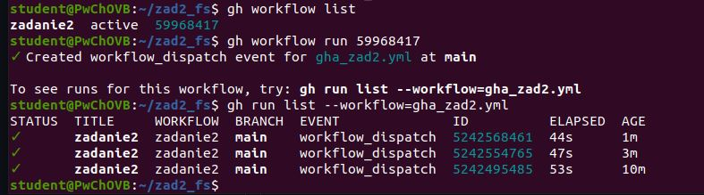
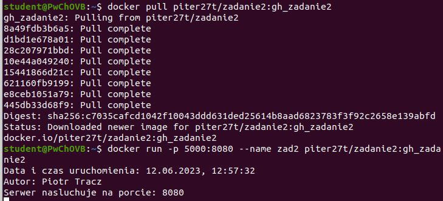
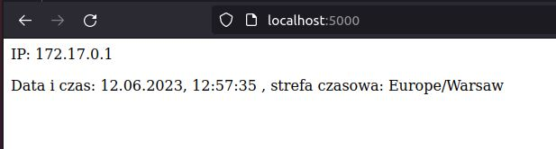

# Zadanie 2
Sprawozdanie do zadania 2

Aby sprawdzic liste workflow uzylem polecenia: ```gh workflow list```

Aby uruchomic workflow za pomoca narzędzia Github CLI uzylem polecenia: ```gh workflow run 59968417```

Aby sprawdzic poprawnosc uzylem polecenia: ```gh run list --workflow=gha_zad2.yml```



Przetestowanie rozwiazania:

Pobranie obrazu z DockerHub: ```docker pull piter27t/zadanie2:gh_zadanie2```

Aby uruchomić kontener na podstawie pobranego obrazu użyłem polecenia ```docker run -p 5000:8080 --name zad2 piter27t/zadanie2:gh_zadanie2```



Efekt dzialania w przegladarce:


